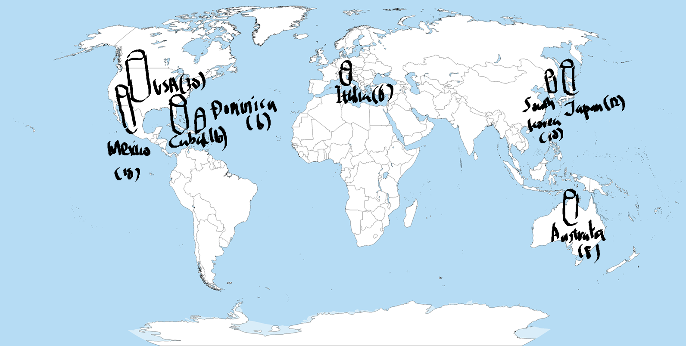
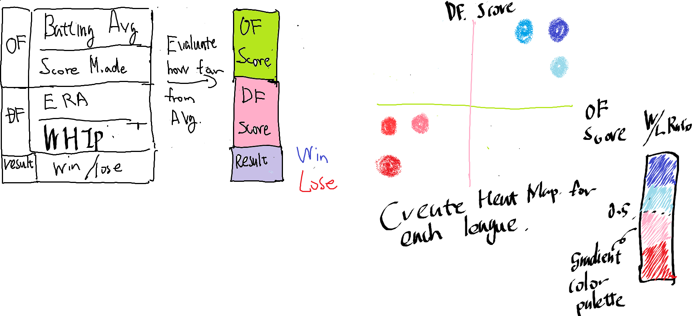

## Final Project

Here are the deliverables of AJ's Final Project

# Outline
I have been a BIG FAN of baseball.  
Though I have only been watching the sport for 15 years, one question has always intrigued me: Which is stronger, an offensive team or a defensive team? 
The team I support is known for being highly offensive, yet they had struggled to win for many years.  
However, this year, they finally won the championship. Interestingly, in the United States, the Los Angeles Dodgers—another offensively dominant team—also won the championship this year.  
This coincidence might not be purely by chance. 

To find an answer to this longstanding question, I believe it's essential to move beyond the assumption that American baseball is the best in the world and instead compare multiple leagues.  
For this analysis, I will focus on data from the past 10 years of Major League Baseball (MLB) in the United States, Nippon Professional Baseball (NPB) in Japan, and the Mexican League in Mexico. 

By analyzing these datasets, I aim to determine whether offensive or defensive teams tend to be stronger. Through this exploration, I hope to uncover insights into this fascinating question.  

# Sketches
1. Professional League in the World
   Mapping of Professional League over the world. 
   
2. Picked League Profile
   Pick the first league from North America, Central America and Asia for 3 leagues to be picked up from the professional leagues
3. Heatmap of Leagues
   The rough sketch of the main data visualization is as follws. 
   
4. Comparison of Leagues
   Utilizing the heatmaps above, per the scores per a game (Offensiveness), the correlation between the weight changes of offence and deffense and the Offensiveness to figure out which is more important.
# Data
Here are the dataset utilized for this data visualization.
[Professional League Geography] 
[World's Professional Baseball Leagues](https://www.insidethegames.biz/articles/1040900/the-worlds-professional-leagues) 
[Team Stats]
[MLB Dataset](https://www.openintro.org/data/csv/mlb_teams.csv) 
[NPB Dataset](https://proeyekyuu.com/) 
[Mexican League](milb.com/mexican/stats/team) 

# Methodology
I will utilize Tableau to visualize the data.

Back to [Main Portfolio](README.md)
