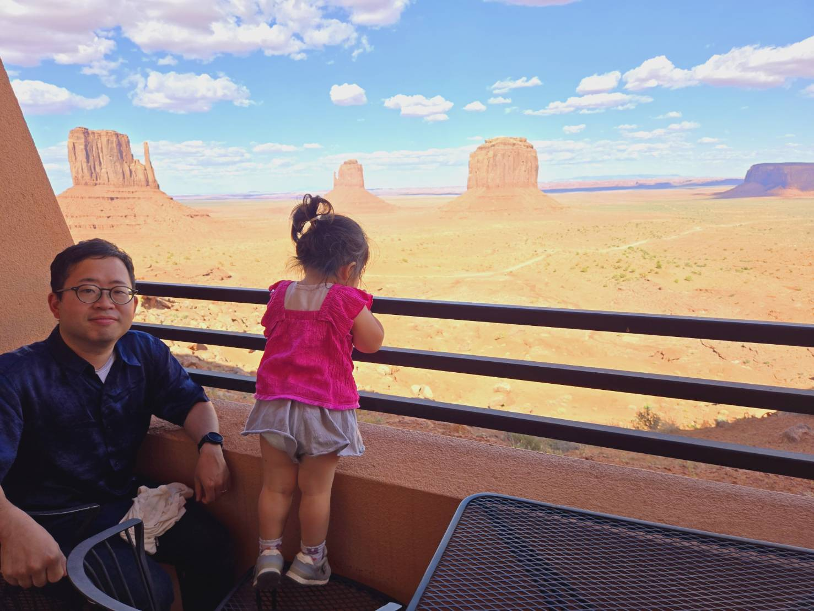

| [home page](https://cmustudent.github.io/tswd-portfolio-templates/) | [visualizing debt](visualizing-government-debt) | [critique by design](critique-by-design) | [final project I](Final_Project_akihikoj.md) | [final project II](final-project-part-two.md) | [final project III](final-project-part-three) |

# Portfolio
Thank you for visiting!
This is my public portfolio for Telling Stories with Data at CMU!  Here's where all my cool work will go.  You should probably hire me. 

# About me
Hi, this is Akihiko Jo in MISM 16, and please call me AJ, because my full name is sometimes difficult to pronounce. I'm from Japan, and I have been working
for financial institutions for 15 years mainly as a project manager. I anticipate to obtain the skills from this course
to efficiently show the data to the executives in my company.
I am a father of 3 years old daughter, and my hobby now is to bring my daughter to the national parks in the United States.

# What I hope to learn
In our past career, it was always practical, and no educational backgroud about technologies. Therefore, we weould like to learn the points below for my future career: 

1. Technical Background 
   I aim to develop IT skills, including coding, which I have not studied systematically before. My goal is to acquire the skills
   necessary to make informed decisions when I eventually move into a management role.
2. Strategical Skills 
   I want to learn how to use technology in alignment with a company’s vision, enabling me to make decisions that reflect this vision.
   I’m interested in understanding how to incorporate the vision into daily activities and make sound strategic decisions
   in a volatile market environment.
3. Soft Skills 
   I want to develop knowledge in negotiation and conflict resolution,
   essential for implementing the decisions I make. This will equip me with the capability to execute my decisions effectively.
   

# Portfolio
## Assignment: [Visualizing overnment Debt](visualizing-government-debt.md)
For this assignment, make sure you set up and link to a new page.  This page is linking to a new Markdown document called `visualizing-government-debt.md`.  For links to Markdown files in your repository, you can just include the name of the page without the `.md` extension. 

# Assignment 3 & 4
[The Assignment 3 & 4](Assignment3-4.md)

# Final Project
Here is a link to each phase of Final Project
Phase 1: [Final Project Part 1](Final_Project_akihikoj.md)
Phase 2: [Final Project Part 2](final-project-part-two.md)
Phase 3: [Final Project Part 3](final-project-part-three.md)

The link below guides you to the webpage I created by Shorthand.
[Final Project_Shorthand](https://preview.shorthand.com/85s7Aany1XBrZRAy)

### Thank you for reading!
