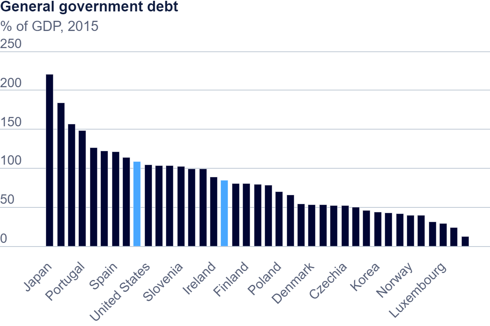

| [home page](https://cmustudent.github.io/tswd-portfolio-templates/) | [visualizing debt](visualizing-government-debt) | [critique by design](critique-by-design) | [final project I](final-project-part-one) | [final project II](final-project-part-two) | [final project III](final-project-part-three) |
 1. OECD Debt
    
 2. OECD Debt (Visualized in Tableau)

<noscript></noscript><object class='tableauViz'  style='display:none;'><param name='host_url' value='https%3A%2F%2Fpublic.tableau.com%2F' /> <param name='embed_code_version' value='3' /> <param name='site_root' value='' /><param name='name' value='TSwD-AJ&#47;TableauWorkshop' /><param name='tabs' value='no' /><param name='toolbar' value='yes' /><param name='static_image' value='https:&#47;&#47;public.tableau.com&#47;static&#47;images&#47;TS&#47;TSwD-AJ&#47;TableauWorkshop&#47;1.png' /> <param name='animate_transition' value='yes' /><param name='display_static_image' value='yes' /><param name='display_spinner' value='yes' /><param name='display_overlay' value='yes' /><param name='display_count' value='yes' /><param name='language' value='en-US' /><param name='filter' value='publish=yes' /></object>

The description below is how we aim to explain and how we made changes on the chart. 
[Objectives] 
To show the transitioning of average of th debt ratio to GDP per region. 
[Points] 
1. Categorized the region based on the countries. (Americas, Asia, Europe, Middle East)
   The original dataset has too many number of countries, and it might be difficult for readers to interpret the trend of the transitioning over time.
   Therefore, I have categorized the countries into 4 categories.
2. Changed the chart color not to be gradient but to distinguish by region
   Original chart was gradienting from Blue to Orange based on the percentage but this is not a good way to explain the differences between the regions.
   Therefore, I have allocated the colors to each line.
3. Drew the reference line at 100% to show the unhealthy threshold.
   In order to show which region is unhealthy, I have drawn the threshold line at 100% so that reader can understand that the area above is shown as unhealthy.
4. Greyed out the area below 100%.
   Highlight the unhealthiness of the area above the line, the area below the line is greyed out.
5. Filtered out 2019 data because that lacks Japan's data since it was the main driver of Asian average ratio.
   If I use all the data in the dataset, Asian unhealthiness looks to improve, but it is because that Japanese data is lacked. 
   Therefore, I have filtered out the data of 2019 to avoid misinterpretation.
6. Set the minimum as 30
   I have cut of the areas below 30 because the minimum value over time was 30. This emphasize the differences among regions.

Those changes could explain that the Asia was the unhelthiest region over time.

